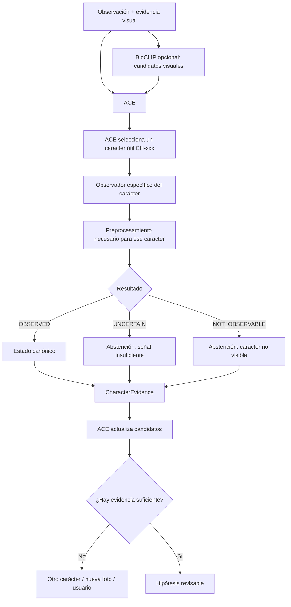

# Hito 16 — Referencia técnica: extracción automática de caracteres botánicos

2026-09-18

**Estado:** EN REVISIÓN — candidata a referencia técnica vigente del Hito 16.  
**Ámbito:** frente de identificación asistida de Árboris.  
**Relación con otras fuentes:** este documento no reemplaza el Master Botánico, el roadmap ni los contratos implementados en código. Consolida el marco técnico revisado del Hito 16 y distingue entre decisiones sustentadas, experimento actual y decisiones todavía `OPEN`.

Su canonización permanece pendiente de aprobación formal, cierre de los puntos abiertos y reauditoría.

## 1. Propósito

El Hito 16 debe demostrar que Árboris puede extraer evidencia botánica visual de forma restringida, trazable y revisable.

Su objetivo no es identificar directamente una especie desde una fotografía. Debe comprobar que un observador visual puede intentar evaluar **un carácter botánico canónico concreto** y devolver solamente:

- un estado permitido para ese carácter;
- `NOT_OBSERVABLE`, cuando la evidencia no permite observarlo;
- `UNCERTAIN`, cuando existe señal visual relevante pero no alcanza para decidir un estado con suficiente fundamento.

La regla arquitectónica es:

> **visión observa caracteres; ACE identifica por evidencia; Árboris no presenta una identificación definitiva ciega.**

La salida esperada no es:

```text
esta hoja es Peumo
```

sino, por ejemplo:

```text
CH-003
status: observed
observedState: serrado
```

o:

```text
CH-003
status: not_observable
```

o:

```text
CH-003
status: uncertain
```

# PARTE I — DECISIONES VIGENTES

## 2. La observación es la fuente de evidencia

Árboris no debe asignar automáticamente a una fotografía los caracteres esperados de una especie conocida.

El flujo válido es:

```text
evidencia visual
→ observación de un carácter
→ estado observado o abstención
→ evidencia estructurada
→ ACE actualiza hipótesis
```

No:

```text
especie conocida
→ asumir que la fotografía contiene sus caracteres esperados
```

Esta regla también gobierna la construcción de datasets de entrenamiento y evaluación.

La especie puede conservarse como dato de control, procedencia o auditoría, pero no debe utilizarse para generar automáticamente el ground truth de un carácter visual.

## 3. Separación de responsabilidades

### Observador visual

Trabaja sobre un carácter canónico.

Puede:

- analizar evidencia concreta;
- usar preprocessing;
- usar segmentación;
- usar geometría;
- usar embeddings;
- devolver evidencia;
- abstenerse.

No puede:

- identificar una especie como salida primaria;
- modificar los estados botánicos permitidos;
- introducir conocimiento botánico paralelo al Master;
- eliminar especies directamente;
- decidir la identificación final.

### ACE

ACE:

- mantiene candidatos;
- interpreta evidencia;
- compara estados observados con estados esperados;
- conserva incompatibilidades y ambigüedad;
- selecciona caracteres informativos;
- decide cuándo falta evidencia;
- mantiene hipótesis revisables.

### Usuario

El usuario sigue siendo parte del ciclo de observación.

Ante evidencia insuficiente, Árboris puede:

- pedir otra fotografía;
- indicar qué parte debe quedar visible;
- pedir otra vista;
- solicitar una ramilla con varios nudos;
- cambiar a otro carácter;
- aceptar una observación humana;
- mantener varios candidatos.

El sistema no debe forzar una respuesta visual cuando la evidencia disponible no permite obtenerla.

## 4. Estados del observador

Tres estados conceptuales válidos:

- `OBSERVED`
- `NOT_OBSERVABLE`
- `UNCERTAIN`

En documentación, los estados se expresan como:

```text
OBSERVED
NOT_OBSERVABLE
UNCERTAIN
```

En contratos ejecutables y datos serializados, sus valores canónicos son:

```text
OBSERVED        → observed
NOT_OBSERVABLE  → not_observable
UNCERTAIN       → uncertain
```

### `OBSERVED`

Existe evidencia visual suficiente para asignar uno de los estados permitidos por el carácter.

Debe incluir:

- `characterId`;
- `status = observed`;
- `observedState`.

Puede incluir, cuando corresponda:

- `confidence`;
- `source`;
- `model`;
- `notes`;
- `provenance`;
- `evidenceRef`;
- `regionOfInterest`.

`observedState` debe pertenecer al vocabulario canónico del carácter.

### `NOT_OBSERVABLE`

El carácter no puede evaluarse a partir de la evidencia disponible.

Ejemplos:

- margen fuera de cuadro;
- ápice cortado;
- cara necesaria no visible;
- ramilla insuficiente;
- fruto ausente;
- resolución insuficiente;
- estructura completamente ocluida.

En datos serializados:

```text
status = not_observable
```

No debe contener un estado botánico inventado.

### `UNCERTAIN`

El carácter es parcialmente observable, pero la evidencia no permite seleccionar de forma suficientemente fiable uno de los estados permitidos.

Ejemplos:

- borde ambiguo entre `serrado` y `dentado`;
- estructura dañada;
- forma intermedia;
- señal débil;
- iluminación insuficiente.

En datos serializados:

```text
status = uncertain
```

No debe contener un estado botánico definitivo.

## 5. Regla de abstención

`NOT_OBSERVABLE` y `UNCERTAIN` son ambos no eliminatorios para ACE, pero no son equivalentes.

Su semántica debe conservarse en la evidencia original y no debe colapsarse en un único estado durante el traspaso desde el observador hacia ACE.

Una abstención correcta es preferible a una observación categórica incorrecta.

El contrato ejecutable de Hito 16 preserva actualmente esta distinción.

## 6. Contrato conceptual del observador

Cada observador trabaja sobre un solo `characterId`.

Entrada mínima conceptual:

```text
characterId
evidence
context
```

Salida conceptual:

```text
characterId
status
observedState
confidence
source
model
evidenceRef
regionOfInterest
notes
provenance
```

Reglas:

1. `observed` requiere `observedState`.
2. `observedState` debe pertenecer a los estados permitidos del carácter.
3. `not_observable` no lleva estado botánico.
4. `uncertain` no lleva estado botánico definitivo.
5. La procedencia debe conservarse.
6. La metadata de evidencia no debe perderse durante la normalización.
7. ACE puede usar una representación mínima para inferencia sin destruir la evidencia rica.
8. `confidence` se conserva cuando existe, debe ser un número entre 0 y 1 y se trata como metadata no inferencial: no modifica por sí sola el filtrado, la resolución ni el retry de ACE.

## 7. Integración con el ciclo de reintento de ACE

El contrato de Hito 15 distingue:

```text
visible
attempted
resolved
```

Hito 16 se integra con esa semántica de la siguiente forma.

### `observed`

Una observación `observed` constituye un intento.

No equivale automáticamente a `resolved`.

```text
observed
→ attempted = true
→ ¿la evidencia reduce candidatos?
    sí → resolved
    no → attempted-no-resuelto
```

Un carácter `observed` que no reduzca candidatos puede volver a solicitarse mediante reintento explícito.

### `not_observable`

```text
not_observable
→ attempted
→ no resuelto
→ no elimina candidatos
→ no reaparece automáticamente
→ retry explícito permitido
```

### `uncertain`

```text
uncertain
→ attempted
→ no resuelto
→ no elimina candidatos
→ no reaparece automáticamente
→ retry explícito permitido
```

Un carácter resuelto es terminal dentro del flujo de reintento vigente.

Este comportamiento está protegido por tests de integración entre `character-observers` y ACE.

## 8. Arquitectura de referencia



La arquitectura no presupone una única tubería de visión.

El preprocessing depende del carácter.

Ejemplos:

```text
dentición del margen
→ contorno / segmentación

forma de lámina
→ geometría

nervadura
→ crop + análisis local

contraste haz-envés
→ ambas superficies bajo condiciones comparables

disposición foliar
→ ramilla + varios nudos

fruto
→ evidencia reproductiva
```

BioCLIP es opcional y no constituye una dependencia del observador de caracteres.

La integración completa entre candidatos visuales, observadores de caracteres y ACE pertenece al Hito 17.

## 9. Ejecución adaptativa

Árboris no necesita ejecutar todos los observadores disponibles sobre cada imagen.

Flujo preferido:

```text
ACE determina qué carácter sería informativo
→ solicita ese carácter
→ se ejecuta su observador
→ se incorpora evidencia o abstención
→ ACE reevalúa
```

Esto conserva la arquitectura adaptativa y evita transformar Hito 16 en una batería indiscriminada de clasificadores.

# PARTE II — HERRAMIENTAS Y REFERENCIAS TÉCNICAS

## 10. LeafMachine2

LeafMachine2 se considera una **referencia y herramienta experimental** de preprocessing y extracción de features.

Puede aportar:

- detección de componentes;
- segmentación de hojas;
- extracción de contornos;
- landmarks;
- largo y ancho;
- geometría de lámina;
- análisis de forma;
- información relacionada con ápice;
- información relacionada con margen.

Referencia:

https://github.com/Gene-Weaver/LeafMachine2

No constituye por sí mismo el observador canónico de Árboris.

No debe suponerse que produce directamente:

```text
CH-003 = serrado
```

Puede producir información intermedia útil para que un observador específico llegue a ese resultado.

Durante Hito 16 debe tratarse como:

```text
herramienta a evaluar
```

y no como:

```text
arquitectura adoptada
```

Su utilidad debe compararse contra soluciones más simples.

Una prueba exitosa en escritorio no decide el runtime final.

Antes de adoptar cualquier componente deberán evaluarse:

- tamaño;
- memoria;
- latencia;
- hardware objetivo;
- ejecución local;
- integración móvil;
- disponibilidad offline.

LeafMachine2 utiliza licencia GPL-3.0.

Su uso experimental no implica automáticamente su adopción como dependencia distribuida del producto.

## 11. Literatura de reconocimiento de rasgos

Los trabajos de reconocimiento conjunto de taxones y traits son útiles como antecedente porque muestran que la observación de rasgos puede tratarse como un problema separado de la clasificación de especies.

```text
observar rasgo ≠ identificar especie
```

Los datasets externos no deben asumirse equivalentes al problema de Árboris.

Una etiqueta de trait asociada a una especie no demuestra necesariamente que ese rasgo sea visible en una fotografía concreta.

Por eso Hito 16 exige ground truth asociado a la evidencia individual.

Referencia:

Younis et al. (2018), *Taxon and trait recognition from digitized herbarium specimens using deep CNNs*.

## 12. Pl@ntNet, PlantCLEF, BioCLIP y embeddings

Pl@ntNet, PlantCLEF, DINOv2, CLIP y sistemas similares son referencias útiles para visión vegetal y embeddings, pero no constituyen el foco principal de Hito 16.

En Árboris:

```text
BioCLIP
→ priorización / generación de candidatos visuales

Hito 16
→ observación de caracteres concretos

ACE
→ integración de evidencia e identificación asistida
```

Estas funciones no deben confundirse.

# PARTE III — EXPERIMENTO ACTUAL

## 13. Selección del primer carácter

El primer observador debe elegirse considerando:

- capacidad discriminante;
- observabilidad fotográfica;
- variabilidad intraespecífica;
- seguridad;
- costo de observación;
- disponibilidad de ejemplos;
- dificultad técnica;
- riesgo de confundir daño con morfología.

## 14. H16-EXP-001 — CH-003 Dentición del margen foliar

Se selecciona como primer experimento:

**CH-003 — Dentición del margen foliar**

**Estado de esta decisión:** experimento actual del Hito 16, no regla permanente para el orden de observadores futuros.

Razones:

- CH-003 está activo en el Master;
- es observable en fotografía;
- posee estados categóricos canónicos;
- presenta variación útil entre las seis especies piloto;
- puede beneficiarse de segmentación y análisis de contorno;
- permite evaluar abstención ante daño u oclusión;
- tiene errores visuales plausibles y auditables.

Estados permitidos:

```text
entero
finamente_serrado
serrado
dentado
```

El observador no puede crear estados botánicos nuevos.

## 15. Caracteres candidatos posteriores

Después de H16-EXP-001 pueden evaluarse, entre otros:

- `CH-010` — Nervaduras secundarias conectadas a reborde marginal;
- `CH-012` — Ápice foliar;
- `CH-011` — Forma de la lámina foliar;
- `CH-008` — Nervadura visualmente contrastante;
- `CH-009` — Nervaduras secundarias visualmente distinguibles.

El orden no queda decidido en este documento.

Debe surgir de evidencia experimental.

### Caracteres no seleccionados como primer target

#### CH-005 — Contraste cromático haz-envés

Permanece activo, pero su observabilidad fotográfica es parcial.

Requiere condiciones comparables de captura y ambas superficies visibles.

No es el primer experimento seleccionado.

#### CH-017 — Dientes con pequeñas glándulas

Está retirado del conjunto computable actual.

No puede convertirse en target del Hito 16 sin una decisión botánica previa que lo reactive en la fuente canónica.

# PARTE IV — DATASET Y EVALUACIÓN

## 16. Dataset mínimo para H16-EXP-001

### 16.1 Objetivo

El dataset de `H16-EXP-001` debe permitir evaluar si un observador visual puede extraer directamente el carácter botánico:

```text
CH-003 — Dentición del margen foliar
```

a partir de evidencia fotográfica.

El objetivo del dataset no es entrenar ni evaluar un clasificador de especies.

La unidad de anotación es la evidencia visible del carácter `CH-003` en una imagen concreta.

El conocimiento de la especie fotografiada puede conservarse como metadata de procedencia y análisis, pero no debe utilizarse para asignar automáticamente la etiqueta del carácter.

### 16.2 Estados botánicos y estados de observación

Estados botánicos permitidos por `CH-003`:

```text
entero
finamente_serrado
serrado
dentado
```

Además, una observación visual puede terminar en:

```text
not_observable
uncertain
```

`not_observable` y `uncertain` son estados de observación, no estados botánicos de la especie.

### 16.3 Regla fundamental de anotación

Cada imagen debe anotarse por lo que realmente puede observarse en esa imagen.

Está prohibido asignar el estado de `CH-003` únicamente porque se conoce la especie fotografiada o porque el Master Botánico registra un estado esperado para esa especie.

Ejemplo incorrecto:

```text
la fotografía pertenece a SP-003
→ SP-003 tiene serrado en el canon
→ etiquetar automáticamente como serrado
```

Ejemplo correcto:

```text
la fotografía muestra el margen con evidencia suficiente
→ el anotador evalúa directamente el margen visible
→ asigna uno de los estados permitidos o se abstiene
```

Esta regla evita fuga de información de especie hacia el observador visual.

### 16.4 Unidad mínima de evidencia

Cada registro del dataset debe corresponder a una imagen o región de imagen evaluable de forma independiente.

Como mínimo debe conservar:

```text
evidenceId
imageRef
characterId
status
observedState
speciesId
annotator
annotationSource
notes
provenance
```

Cuando exista información disponible también debe preservarse:

```text
regionOfInterest
individualId
sessionId
location
date
imageOrigin
reviewHistory
```

### 16.5 Estado `observed`

Usar cuando el margen foliar visible permite asignar de forma suficientemente clara uno de los estados canónicos de `CH-003`.

Debe existir un `observedState`.

Ejemplo:

```json
{
  "evidenceId": "EV-CH003-0001",
  "imageRef": "IMG-0001",
  "characterId": "CH-003",
  "status": "observed",
  "observedState": "serrado",
  "speciesId": "SP-005",
  "annotator": "human_validated",
  "annotationSource": "direct_visual_annotation",
  "notes": "margen completo visible; sin daño relevante",
  "provenance": {
    "origin": "canonical_pilot_photo"
  }
}
```

### 16.6 Estado `not_observable`

Usar cuando la imagen no permite evaluar `CH-003`.

Ejemplos:

- margen fuera de cuadro;
- hoja demasiado pequeña;
- resolución insuficiente;
- borde completamente ocluido;
- desenfoque que impide evaluar la dentición;
- solo se observa una parte insuficiente del margen;
- daño tan extenso que el margen original no puede examinarse.

No debe existir un `observedState`.

Ejemplo:

```json
{
  "evidenceId": "EV-CH003-0002",
  "imageRef": "IMG-0002",
  "characterId": "CH-003",
  "status": "not_observable",
  "observedState": null,
  "speciesId": "SP-002",
  "annotator": "human_validated",
  "annotationSource": "direct_visual_annotation",
  "notes": "margen fuera de foco",
  "provenance": {
    "origin": "canonical_pilot_photo"
  }
}
```

### 16.7 Estado `uncertain`

Usar cuando el margen es visible, pero la evidencia no permite elegir con suficiente fundamento un único estado canónico.

Ejemplos:

- límite visual ambiguo entre `serrado` y `dentado`;
- dentición demasiado tenue;
- margen parcialmente dañado pero todavía visible;
- iluminación que altera la percepción del borde;
- expresión morfológica intermedia;
- desacuerdo no resuelto entre anotadores.

No debe forzarse un `observedState`.

Ejemplo:

```json
{
  "evidenceId": "EV-CH003-0003",
  "imageRef": "IMG-0003",
  "characterId": "CH-003",
  "status": "uncertain",
  "observedState": null,
  "speciesId": "SP-006",
  "annotator": "human_validated",
  "annotationSource": "direct_visual_annotation",
  "notes": "margen visible pero ambiguo entre entero y dentado",
  "provenance": {
    "origin": "canonical_pilot_photo"
  }
}
```

### 16.8 Daño, herbivoría y alteraciones

El daño no debe interpretarse como dentición botánica.

Deben distinguirse del margen natural:

- mordeduras;
- roturas;
- necrosis;
- pliegues;
- deformaciones;
- cortes;
- otras alteraciones.

Reglas:

```text
daño localizado + margen natural suficiente visible
→ observed, si el estado puede evaluarse

daño parcial que impide una decisión fiable
→ uncertain

daño que impide examinar el margen natural
→ not_observable
```

La anotación debe registrar el daño relevante en `notes`.

### 16.9 Anotación humana

La primera versión del dataset debe utilizar anotación humana explícita.

Cada registro debe identificar al menos:

```text
quién anotó
qué imagen anotó
qué carácter evaluó
qué estado asignó
si la decisión fue directa o revisada
```

La anotación no debe generarse automáticamente desde la relación especie-caracter del Master.

Cuando sea posible, una muestra del dataset debe recibir una segunda revisión independiente.

### 16.10 Desacuerdos

Si dos anotadores asignan estados botánicos diferentes:

1. conservar ambas anotaciones originales;
2. no sobrescribir silenciosamente ninguna;
3. realizar revisión;
4. registrar la decisión final;
5. conservar la procedencia de la decisión.

Si el desacuerdo no puede resolverse mediante la evidencia disponible, el estado final debe ser:

```text
uncertain
```

La corrección de una anotación no debe borrar su historial.

### 16.11 Procedencia

Cada imagen debe conservar su origen.

Como mínimo debe poder distinguirse entre:

- fotografía canónica del piloto;
- fotografía externa autorizada;
- fotografía tomada específicamente para el experimento;
- derivación o recorte de otra imagen.

Un recorte no debe perder la referencia hacia la imagen de origen.

La procedencia debe permitir reconstruir posteriormente qué evidencia intervino en:

- entrenamiento;
- validación;
- test;
- benchmark.

### 16.12 Separación entrenamiento / validación / prueba

No debe realizarse una división aleatoria simple cuando existan fotografías relacionadas.

Fotografías del mismo:

- individuo;
- sesión;
- secuencia;
- original;
- conjunto de recortes derivados;

deben permanecer dentro de la misma partición.

Unidad preferida de separación:

```text
individuo
→ sesión / origen
→ imagen
```

según la metadata realmente disponible.

El objetivo es evitar que imágenes prácticamente equivalentes aparezcan tanto en desarrollo como en evaluación.

La partición final podrá adoptar:

```text
train
validation
test
```

cuando exista suficiente evidencia independiente.

Para el conjunto actual del piloto se define inicialmente:

```text
development
holdout
```

porque varias especies todavía cuentan con solo dos individuos documentados.

### 16.13 Cobertura canónica de CH-003 en el piloto

La cobertura esperada del carácter `CH-003` en las seis especies piloto es actualmente:

```text
SP-001 Peumo     → entero
SP-002 Litre     → entero
SP-003 Bollén    → serrado
SP-004 Mitique   → serrado
SP-005 Colliguay → serrado
SP-006 Quillay   → entero, dentado
```

Por tanto, la cobertura canónica actual es:

```text
entero             → cubierto
serrado            → cubierto
dentado            → cubierto
finamente_serrado  → sin cobertura en las seis especies piloto
```

Esta tabla describe el conocimiento canónico de las especies.

No debe utilizarse para asignar automáticamente etiquetas a fotografías individuales.

### 16.14 Decisión sobre `finamente_serrado`

`finamente_serrado` permanece como estado canónico válido de `CH-003`.

No debe eliminarse del vocabulario del carácter.

Sin embargo, ninguna de las seis especies piloto tiene actualmente `finamente_serrado` como estado esperado canónico.

Por tanto, para `H16-EXP-001`:

- no se inventarán ejemplos;
- no se reclasificarán fotografías para llenar artificialmente la clase;
- no se modificará el Master para producir cobertura experimental;
- no se eliminará `finamente_serrado` del vocabulario canónico;
- no será una clase obligatoria para considerar válido el primer benchmark;
- podrá incorporarse en una evaluación posterior cuando exista evidencia visual anotada y respaldo botánico canónico suficiente.

Estado de esta decisión:

```text
ACCIÓN 7 — CERRADA
```

La ausencia de cobertura experimental de `finamente_serrado` debe informarse como limitación del dataset, no ocultarse ni compensarse artificialmente.

### 16.15 Dataset inicial del piloto

Las 45 fotografías canónicas de las seis especies constituyen una fuente inicial de evidencia.

No constituyen automáticamente un dataset de entrenamiento válido.

Distribución actual por especie:

```text
SP-001 Peumo:      4
SP-002 Litre:     12
SP-003 Bollén:     7
SP-004 Mitique:    8
SP-005 Colliguay:  7
SP-006 Quillay:    7
Total:            45
```

Cada fotografía debe pasar por el protocolo de anotación de `CH-003` antes de considerarse ejemplo etiquetado del experimento.

Una imagen puede resultar:

```text
observed
not_observable
uncertain
```

independientemente de la especie a la que pertenezca.

### 16.16 Anti-leakage

Para `H16-EXP-001`, el modelo no debe recibir como entrada:

- `speciesId`;
- nombre común;
- nombre científico;
- carpeta que revele directamente la especie;
- filename que revele directamente la especie;
- estado esperado obtenido de la matriz especie-caracter;
- metadata utilizada únicamente para identificar taxonómicamente la fotografía.

`speciesId` puede conservarse fuera de la entrada del modelo para:

- auditoría;
- análisis de errores;
- evaluación estratificada;
- control de procedencia.

Además:

- fotografías del mismo individuo deben permanecer en la misma partición;
- recortes derivados de la misma fotografía deben permanecer en la misma partición;
- duplicados no deben contarse como evidencia independiente;
- una imagen utilizada para ajustar un observador no puede utilizarse posteriormente como holdout independiente.

### 16.17 Correcciones

Toda corrección posterior debe conservar:

```text
valor anterior
valor nuevo
motivo
autor de la corrección
fecha o versión
```

No deben sobrescribirse silenciosamente anotaciones utilizadas en un experimento ya registrado.

### 16.18 Split anti-leakage inicial de H16-EXP-001

El split inicial del experimento se define por `individual_id`, no por fotografía individual.

No se permite que fotografías del mismo individuo aparezcan simultáneamente en `development` y `holdout`.

El conjunto actual contiene 15 individuos documentados.

Debido a que varias especies del piloto tienen solo dos individuos disponibles, no se fuerza todavía una división de tres vías `train / validation / test`.

Se adopta inicialmente:

```text
development
holdout
```

#### Development

El conjunto `development` puede utilizarse para:

- preparación del dataset;
- anotación;
- desarrollo del baseline;
- ajuste experimental;
- evaluación preliminar;
- comparación de alternativas;
- ajuste de reglas o parámetros.

Asignación:

```text
SP-001
CA001
→ PH-001
→ PH-002
→ PH-003

SP-002
LC001
→ PH-004
→ PH-005
→ PH-006
→ PH-007
→ PH-008

LC002
→ PH-009

LC004
→ PH-030
→ PH-031
→ PH-032
→ PH-033

SP-003
KO001
→ PH-010
→ PH-011
→ PH-012
→ PH-013

KO002
→ PH-014

SP-004
PM001
→ PH-015
→ PH-016
→ PH-017
→ PH-018

SP-005
CO001
→ PH-019
→ PH-020
→ PH-021
→ PH-022
→ PH-023

SP-006
QS001
→ PH-024
→ PH-025
→ PH-026
```

Total:

```text
30 fotografías utilizables
```

#### Holdout bloqueado

El conjunto `holdout` debe mantenerse fuera del desarrollo del observador y del ajuste de sus reglas o parámetros.

Asignación:

```text
SP-001
CA002
→ PH-027

SP-002
LC003
→ PH-028

SP-003
KO003
→ PH-034
→ PH-035

SP-004
PM002
→ PH-036
→ PH-037
→ PH-038
→ PH-039

SP-005
CO002
→ PH-040
→ PH-041

SP-006
QS002
→ PH-042
→ PH-043
→ PH-044
→ PH-045
```

Total:

```text
14 fotografías utilizables
```

#### Exclusión

```text
PH-029
```

`PH-029` permanece excluida porque está registrada como posible duplicado de `PH-028`.

No debe contarse como:

- fotografía independiente;
- nuevo individuo;
- evidencia independiente;
- ejemplo adicional de entrenamiento;
- ejemplo adicional de evaluación.

Distribución total:

```text
45 fotografías registradas

30 → development
14 → holdout
 1 → excluida

44 fotografías utilizables
```

#### Reglas de congelamiento del split

1. El split se fija por `individual_id`.
2. Un individuo no puede aparecer en ambas particiones.
3. El split se define antes de utilizar las etiquetas visuales definitivas de `CH-003` para optimizar balance.
4. No deben moverse fotografías entre particiones posteriormente para mejorar artificialmente resultados o cobertura de clases.
5. Nuevas fotografías de un individuo ya conocido deben heredar la partición de ese individuo.
6. Todo crop, ROI o derivado debe permanecer en la misma partición que su imagen de origen.
7. Un duplicado debe permanecer excluido o dentro de la misma partición que su original, pero nunca actuar como evidencia independiente.
8. El `holdout` no debe utilizarse para definir umbrales, ajustar reglas ni seleccionar el mejor modelo.
9. `speciesId` puede utilizarse para análisis posterior, pero no como entrada del observador.
10. La composición del split debe registrarse junto con los resultados del experimento.

#### Limitación del split

Todas las fotografías actuales fueron registradas el:

```text
2026-09-11
```

Por tanto, este split permite evaluar principalmente:

```text
generalización entre individuos
```

No demuestra generalización entre:

- fechas;
- campañas;
- localidades;
- condiciones ambientales;
- condiciones de iluminación independientes;
- dispositivos de captura;
- estaciones;
- estados fenológicos distintos.

La generalización entre campañas permanece pendiente hasta incorporar evidencia adicional independiente.

Estado de esta decisión:

```text
ACCIÓN 8 — CERRADA
```

### 16.19 Cobertura observada del dataset

Antes de entrenar o comparar modelos debe calcularse la cobertura real después de la anotación humana.

Debe informarse explícitamente cuántos registros resultan:

```text
observed → entero
observed → serrado
observed → dentado
observed → finamente_serrado
not_observable
uncertain
```

No se debe asumir que la distribución observada coincidirá exactamente con los estados esperados por especie.

Una fotografía de una especie cuyo estado canónico sea conocido puede resultar `not_observable` o `uncertain`.

### 16.20 Política de `confidence`

`confidence` es metadata opcional producida por un observador.

Cuando está presente debe ser un número entre 0 y 1.

Para Hito 16 su semántica operacional queda fijada de la siguiente manera:

- se conserva junto con la evidencia original;
- no modifica el filtrado de candidatos de ACE;
- no determina por sí sola si un carácter está `resolved`;
- no modifica las reglas de `retry`;
- no convierte `uncertain` o `not_observable` en `observed`;
- no representa una probabilidad de especie;
- no autoriza por sí sola una identificación ni la eliminación de candidatos.

Por tanto:

```text
confidence = metadata del observador
confidence ≠ autoridad inferencial
```

Dos evidencias idénticas salvo por `confidence` deben producir el mismo resultado de filtrado en ACE.

Este comportamiento está protegido por un test de integración que compara evidencia con:

```text
confidence = 0
confidence = 1
```

y exige resultados de inferencia idénticos.

Los posibles usos futuros de `confidence`, incluida su calibración o la introducción de umbrales operacionales, requieren un contrato explícito posterior. No pueden incorporarse implícitamente al comportamiento de ACE.

Estado de esta decisión:

```text
ACCIÓN 9 — CERRADA
```

### 16.21 Criterio mínimo para iniciar benchmark

`H16-EXP-001` puede pasar de preparación de dataset a benchmark cuando exista:

- anotación visual directa de los ejemplos utilizados;
- separación explícita entre `observed`, `not_observable` y `uncertain`;
- cobertura observada por estado calculada;
- procedencia conservada;
- split anti-leakage definido;
- tratamiento documentado de daño y herbivoría;
- mecanismo de revisión de desacuerdos;
- ausencia de etiquetas heredadas automáticamente desde `speciesId`;
- holdout congelado;
- duplicados excluidos o controlados.

Hasta cumplir estos puntos, el dataset se considera:

```text
EN PREPARACIÓN
```

y no una base validada para comparar modelos.

## 17. Métricas

No basta con accuracy global.

El benchmark debe medir:

- exactitud entre estados observados;
- precision por estado;
- recall por estado;
- matriz de confusión;
- tasa de abstención;
- `not_observable` correcto;
- `uncertain` correcto;
- errores de sobreconfianza;
- errores por daño;
- errores por oclusión;
- errores por variación intraespecífica.

### Métrica crítica

Debe medirse explícitamente cuántos casos el sistema entrega:

```text
observed + estado concreto
```

cuando debía abstenerse.

Para Árboris, la falsa certeza es un error más grave que una abstención correctamente justificada.

# PARTE V — PLAN DEL EXPERIMENTO

## 18. Fase A — Preparar dataset CH-003

Objetivos:

- revisar fotografías disponibles;
- anotar visualmente `CH-003`;
- registrar `not_observable`;
- registrar casos `uncertain`;
- registrar daño y oclusión;
- conservar procedencia;
- aplicar el split anti-leakage congelado;
- calcular cobertura observada por estado.

## 19. Fase B — Baseline simple

Antes de introducir modelos complejos:

- probar crop manual o semiautomático;
- probar segmentación simple;
- probar extracción de contorno;
- establecer un baseline reproducible.

El baseline permite determinar si la complejidad adicional agrega valor real.

## 20. Fase C — Evaluar LeafMachine2

Ejecutar LeafMachine2 sobre el mismo conjunto.

Medir:

- detección correcta;
- calidad de segmentación;
- preservación del margen;
- desempeño en fotografías reales;
- fallos sistemáticos;
- costo computacional;
- utilidad real de las features para `CH-003`.

La pregunta experimental es:

> ¿LeafMachine2 mejora de forma suficiente la observación de CH-003 respecto del baseline?

No:

> ¿LeafMachine2 funciona en términos generales?

## 21. Fase D — Observador CH-003

Implementar la mínima solución capaz de producir:

```text
entero
finamente_serrado
serrado
dentado
uncertain
not_observable
```

La capacidad contractual de producir `finamente_serrado` debe mantenerse aunque el dataset inicial no contenga actualmente cobertura canónica suficiente para evaluarlo.

El observador debe respetar el contrato de Hito 16.

## 22. Fase E — Integración con ACE

El resultado debe llegar a ACE como evidencia no autoritativa.

El observador no debe:

- eliminar especies;
- elegir especie;
- alterar la clave;
- incorporar reglas específicas por especie;
- resolver la hipótesis final.

ACE mantiene esa responsabilidad.

La integración contractual mínima entre observadores y ACE ya cuenta con pruebas para:

- preservación de metadata;
- `uncertain`;
- `not_observable`;
- `observed`;
- retry explícito;
- terminalidad de caracteres resueltos.

## 23. Fase F — Auditoría

La evaluación del experimento debe cerrar con:

```text
AUDITORÍA
INCONSISTENCIAS
VACÍOS / OMISIONES
REDUNDANCIAS
```

También debe incluir:

- resultados de validación;
- decisiones todavía `OPEN`;
- fallos conocidos;
- ejemplos negativos;
- limitaciones del dataset;
- limitaciones del observador;
- cobertura real de clases;
- composición exacta del holdout;
- cualquier desviación del protocolo original.

# PARTE VI — CRITERIO DE CIERRE

## 24. Criterio de éxito del Hito 16

Hito 16 no requiere construir observadores para todos los caracteres.

Se considera demostrado cuando, para al menos un carácter activo del Master:

1. recibe evidencia fotográfica real;
2. intenta observar únicamente ese carácter;
3. devuelve un estado canónico permitido, `uncertain` o `not_observable`;
4. no identifica directamente una especie;
5. conserva procedencia y estado de incertidumbre;
6. puede abstenerse ante evidencia insuficiente;
7. cuenta con benchmark contra anotación humana;
8. entrega evidencia compatible con ACE;
9. no introduce conocimiento botánico paralelo a las fuentes canónicas;
10. demuestra que el patrón puede extenderse posteriormente a otros caracteres;
11. utiliza un benchmark con separación anti-leakage documentada;
12. declara explícitamente las clases no cubiertas por el dataset.

Si `H16-EXP-001` con `CH-003` satisface estos criterios, la tesis técnica del Hito 16 queda validada.

# PARTE VII — DECISIONES OPEN

## 25. OPEN técnico

Permanecen abiertas:

- herramienta final de segmentación;
- arquitectura interna del observador `CH-003`;
- adopción o descarte de LeafMachine2;
- umbrales de confianza;
- tamaño mínimo definitivo del dataset;
- calibración de confianza;
- formato definitivo de persistencia de evidencia visual;
- formato definitivo de `regionOfInterest`;
- modelo final para runtime local;
- arquitectura móvil;
- estrategia concreta de inferencia offline;
- reglas UX para pedir otra fotografía;
- transición hacia observación humana;
- orden del segundo y posteriores caracteres;
- incorporación futura de cobertura válida para `finamente_serrado`;
- evaluación de generalización entre campañas independientes.

### OPEN de gobernanza

Permanece pendiente la aprobación formal de esta referencia técnica como documento `VIGENTE` del Hito 16.

Mientras no exista esa aprobación y no se hayan cerrado los bloqueos técnicos de auditoría, este documento permanece:

```text
EN REVISIÓN
```

# PARTE VIII — ESTADO DE IMPLEMENTACIÓN Y PRÓXIMAS ACCIONES

## 26. Snapshot histórico de implementación al 2026-09-18

La lista siguiente describe el estado registrado para esta referencia el 2026-09-18. Es evidencia histórica de esa revisión, no una declaración del estado actual de la rama. El cierre posterior de H16 C1.3 R1.1 se registra en [`H16_C1_3_R1_1_CLOSEOUT_2026-09-20.md`](H16_C1_3_R1_1_CLOSEOUT_2026-09-20.md).

En el snapshot del 2026-09-18:

- [x] Estado documental corregido a `EN REVISIÓN`.
- [x] Vocabulario conceptual y serializado normalizado.
- [x] `uncertain` y `not_observable` preservados por separado.
- [x] Metadata rica preservada durante normalización de evidencia.
- [x] Integración con ciclo `attempted / resolved / retry` validada.
- [x] En aquel snapshot se registró la rama de Hito 16 como rebasada sobre el `main` vigente. Este dato histórico no describe ni autoriza sincronizar la rama de trabajo actual.
- [x] Tests de ACE: `24/24 PASS`.
- [x] Tests de observadores e integración H16: `29/29 PASS`.
- [x] En aquel snapshot se registró el gate integrado `npm test`: PASS. No es el resultado de pruebas ejecutadas para el cierre R1.1 del 2026-09-20.
- [x] Protocolo mínimo de dataset `CH-003` definido.
- [x] Cobertura de `finamente_serrado` revisada.
- [x] `finamente_serrado` mantenido en el vocabulario canónico sin inventar cobertura experimental.
- [x] Split anti-leakage inicial definido por `individual_id`.
- [x] `PH-029` excluida como posible duplicado de `PH-028`.
- [x] Holdout inicial materializado y protegido por tests.
- [x] `confidence` fijada como metadata no inferencial y protegida por test.

El comando:

```text
npm.cmd run typecheck
```

no constituye actualmente un gate ejecutable completo porque el repositorio no dispone de una configuración raíz `tsconfig.json` que `tsc --noEmit` pueda cargar.

Esto se registra como:

```text
BLOCKED
```

no como fallo de Hito 16.

## 27. Secuencia pendiente

- [x] Materializar la infraestructura de `H16-EXP-001`: split, archivo de anotaciones, loader y garantías anti-leakage.
- [ ] Ejecutar anotación humana de `CH-003` y poblar `annotations.json`.
- [ ] Calcular cobertura observada por clase.
- [ ] Confirmar que los derivados y crops respeten el split por individuo.
- [ ] Construir baseline simple.
- [ ] Ejecutar prueba comparativa con LeafMachine2.
- [ ] Implementar observador mínimo de `CH-003`.
- [ ] Ejecutar benchmark sobre holdout congelado.
- [ ] Auditar resultados.
- [ ] Resolver decisiones `OPEN` necesarias para cierre.
- [ ] Integrar y cerrar PR #22 cuando corresponda.
- [ ] Reauditar documentación e implementación.
- [ ] Registrar aprobación formal de dirección de proyecto.
- [ ] Cambiar el estado a `VIGENTE` únicamente después del gate de canonización.

# PARTE IX — AUTORIDADES Y REFERENCIAS

## 28. Fuentes internas

Autoridad botánica:

```text
data/source/Base_botanica_Pokedex_flora_Master_2.0_FINAL.xlsx
```

Derivados y fuentes relacionadas:

```text
data/botanical/characters.json
data/botanical/species_characters.json
data/botanical/model_errors.json
data/botanical/photos.json
```

Documentación relevante:

```text
docs/START_HERE.md
docs/ROADMAP.md
docs/PRODUCT_PRINCIPLES.md
docs/DEVELOPMENT_MANUAL.md
docs/ARBORIS_CHARACTER_EVIDENCE_ENGINE.md
docs/HITO15_CHARACTER_RETRY_CONTRACT.md
docs/HITO15_SUPPORTED_CONTRACT.md
```

Implementación relevante:

```text
tools/canonical-identification/
tools/character-observers/
```

El Master conserva la autoridad botánica.

El código y tests vigentes representan la realidad implementada.

Mientras permanezca `EN REVISIÓN`, este documento no gobierna por sí solo el Hito 16.

## 29. Referencias externas

### LeafMachine2

https://github.com/Gene-Weaver/LeafMachine2

### Paper de LeafMachine2

*From leaves to labels: building modular machine learning networks for rapid herbarium specimen analysis with LeafMachine2.*

### Natural History Museum — CV leaf traits

https://github.com/NaturalHistoryMuseum/cv-leaf-traits

### Younis et al. (2018)

*Taxon and trait recognition from digitized herbarium specimens using deep CNNs.*

### Pl@ntNet

https://github.com/plantnet

### PlantCLEF

https://github.com/dsgt-arc/plantclef-2025

### Otros antecedentes

- BioCLIP;
- DINOv2;
- CLIP;
- modelos de embeddings;
- trabajos de segmentación de hojas;
- extracción automatizada de rasgos morfológicos.

Estas referencias informan experimentos.

No constituyen autoridad botánica ni decisiones arquitectónicas por sí mismas.

# PARTE X — SÍNTESIS

## 30. Síntesis del Hito 16

Hito 16 debe probar una idea específica:

```text
ACE pregunta por un carácter
→ visión intenta observar ese carácter
→ devuelve evidencia o abstención
→ ACE interpreta esa evidencia
```

No es:

```text
foto
→ modelo
→ especie
```

Tampoco es:

```text
foto
→ extraer indiscriminadamente todos los caracteres
→ clasificador general
```

El experimento actual es:

```text
H16-EXP-001
CH-003 — Dentición del margen foliar
```

El protocolo experimental actual establece además:

```text
ground truth
→ anotación visual directa

finamente_serrado
→ estado canónico válido
→ sin cobertura actual en las seis especies piloto
→ no exigible en el primer benchmark

split
→ por individual_id

development
→ 30 fotografías

holdout bloqueado
→ 14 fotografías

excluida
→ PH-029

generalización demostrable con este dataset
→ entre individuos

generalización entre campañas
→ todavía no demostrada
```

LeafMachine2 se evaluará como posible herramienta de preprocessing, no como arquitectura decidida.

La arquitectura de Árboris continúa gobernada por cuatro principios:

> **evidencia antes que inferencia; observación antes que identificación; incertidumbre antes que falsa certeza; trazabilidad antes que automatización opaca.**

